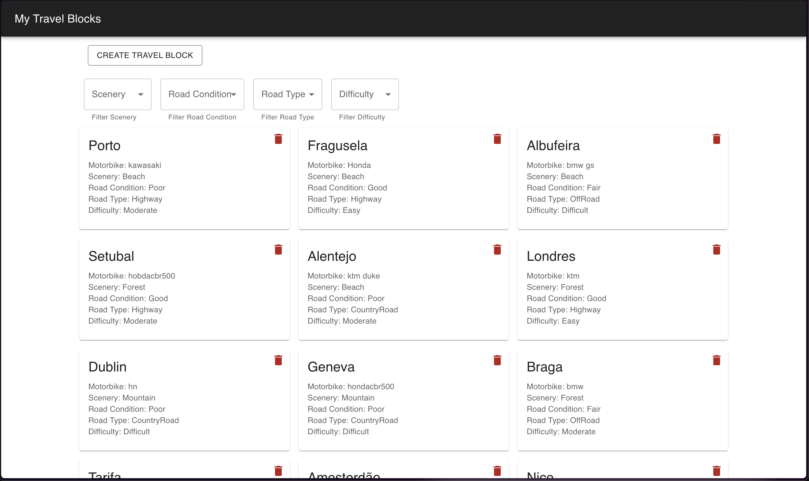
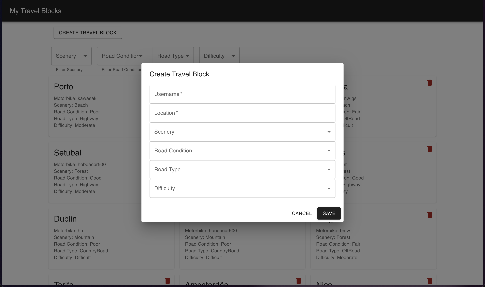
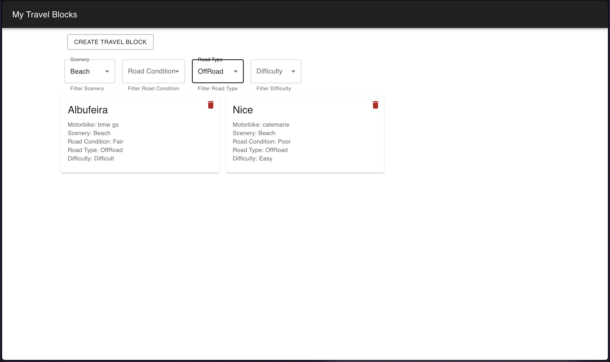
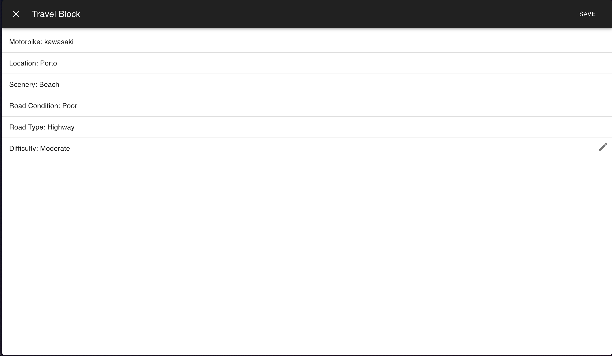

# Routerbike

This project was developed to improve my skills in developing a web application with frontend and backend fully separated.

## Frontend

It was built on React using Material UI. The main page consists of a display of travel blocks that have several information like user id, location, scenery, road condition, road type and difficulty. It is also possible to delete each block individually.

To create a new block, there is a button at the top to do that. It opens a modal with the form to create the block:

It is also possible to filter the blocks that the user wants to see, using the select windows under the "create a travel block" button. When the filters are selected the page updates the blocks immediately: 

Each block is selectable and allows the user to edit the travel block information and update it:

## Backend

The backend was developed in Java with Spring Boot and built an API using CRUD operations to learn more about the Model Repository Controller Service structure.

### POST

Creates a new block

    api/travelBlocks

### GET

Gets all the blocks created and filters them

    api/travelBlocks

and to filter the blocks it uses queries:
- **scenery** (Beach | Mountain | Forest)
- **roadType** (Highway | OffRoad | CountryRoad)
- **roadCondition** (Poor | Fair | Good)
- **difficulty** (Easy | Moderate | Hard)

  example:

      api/travelBlocks?scenery=Beach&roadType=OffRoad

### PUT

Edits a specific block

    api/travelBlocks/{travel_id}
   
### DELETE

Deletes a specific block

    api/travelBlocks/{travel_id}

## Postgres Database

### Travel Block Table Example

| travel_id  | user_id     | location     | scenery     | road condition  | road type   | difficulty      |
|:----------:|:-----------:| :-----------:| :---------: |:---------------:| :----------:| :-------------: |
| 1          | hondacbr500 | Porto        | Beach       | Poor            | OffRoad     | Moderate        |
| 2          | bmwgs1200   | Viseu        | Mountain    | Good            | Highway     | Easy            |

